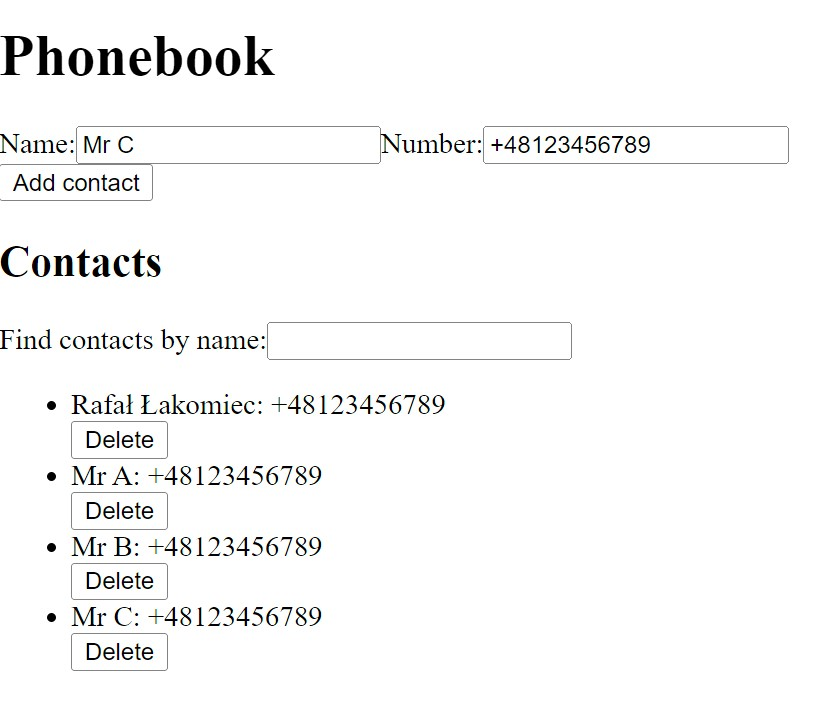
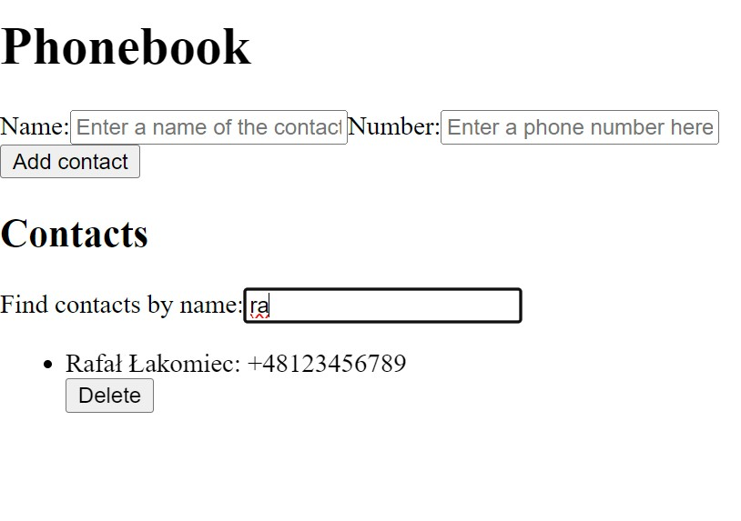

# Phonebook

## Contents
* [General info](#general-info)
* [Technologies](#technologies)
* [Usage](#usage)
* [Examples](#examples)

## General info
Add, store, review, find and manage your phone contacts. 
Checks case insensitive for existing contact. 
Data storage is done locally in your browser memory. Do not clear it to preserve enterred data between sessions.
React web application done as an course assignment.

## Technologies
* React on Vite
* JavaScript
* CSS
* HTML

## Usage
You can try app demo hosted on [GitHub Pages](https://rafallakomiec.github.io/goit-react-hw-04-phonebook/)
Alternatively clone the repository, install [Node.js](https://nodejs.org/en/download/current) and run following commands in your terminal:

```
$ cd ./ // local repository root
$ npm install
$ npm run build
$ npm run preview
```

## Examples




